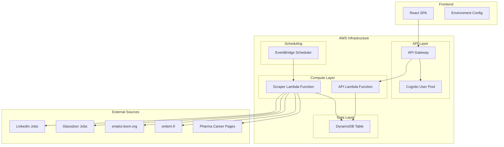

# Design Document

## Overview

The Regulatory Jobs Application is a serverless web application built on AWS that automatically scrapes medical device regulatory job postings from multiple sources and provides users with a filtered, searchable interface. The system consists of three main layers: infrastructure (AWS CDK), backend (Python Lambda functions), and frontend (React SPA).

The architecture follows a event-driven serverless pattern where job scraping occurs automatically three times daily via EventBridge Scheduler, data is stored in DynamoDB, and users access the data through a REST API served by API Gateway with Cognito authentication.

## Architecture

The system uses a serverless microservices architecture with the following components:



## Components and Interfaces

### Infrastructure Layer (AWS CDK)
- **CDK Stack**: Defines and deploys all AWS resources
- **API Gateway**: RESTful API endpoint with CORS configuration and API Key authentication
- **Lambda Functions**: Serverless compute for API and scraping operations
- **DynamoDB Table**: NoSQL database for job storage with GSI for filtering
- **EventBridge Scheduler**: Triggers scraper function three times daily
- **IAM Roles**: Least-privilege access policies for each component

### Backend Layer (Python Lambda Functions)

#### API Lambda Function
- **Endpoint**: `/jobs` with GET method
- **Query Parameters**: 
  - `published_after`: ISO date string for date filtering
  - `min_experience`: Integer for minimum years of experience
  - `max_experience`: Integer for maximum years of experience
  - `city`: String for city filtering within Île-de-France
- **Response Format**: JSON array of job objects
- **Authentication**: API Key authentication via X-API-Key header

#### Scraper Lambda Function
- **Trigger**: EventBridge Scheduler (3 times daily: 6 AM, 2 PM, 10 PM UTC)
- **Concurrency**: Configured with reserved concurrency of 20 to enable faster parallel processing
- **Parallel Processing**: Uses asyncio and aiohttp for concurrent scraping of multiple sources
- **Web Scraping**: Uses requests/aiohttp and BeautifulSoup for HTML parsing
- **Rate Limiting**: Implements delays between requests to respect robots.txt and avoid IP blocking
- **Data Validation**: Ensures job postings meet criteria before storage
- **Duplicate Detection**: Uses job URL as unique identifier
- **Batch Processing**: Groups DynamoDB writes in batches of 25 items for efficiency

### Frontend Layer (React SPA)
- **Framework**: Vite + React + TypeScript
- **Authentication**: API Key authentication via X-API-Key header
- **State Management**: React hooks for local state
- **HTTP Client**: Native fetch API for API communication
- **UI Components**: 
  - Job listing grid/list view
  - Filter sidebar with date and experience controls
  - Loading states and error handling
  - Responsive design for mobile and desktop

## Data Models

### Job Record (DynamoDB)
```typescript
interface JobRecord {
  job_id: string;              // Primary key (hash of URL)
  job_title: string;           // Job title
  company_name: string;        // Company name
  city: string;                // City within Île-de-France
  year_of_experience: number;  // Required years of experience
  published_date: string;      // ISO 8601 date string
  link: string;                // Original job posting URL
  source: string;              // Source website (LinkedIn, Glassdoor, etc.)
  description?: string;        // Job description (optional)
  salary_range?: string;       // Salary information if available
  created_at: string;          // Timestamp when record was created
  updated_at: string;          // Timestamp when record was last updated
}
```

### API Response Models
```typescript
interface JobsResponse {
  jobs: JobRecord[];
  total_count: number;
  filters_applied: {
    published_after?: string;
    min_experience?: number;
    max_experience?: number;
    city?: string;
  };
}

interface ErrorResponse {
  error: string;
  message: string;
  timestamp: string;
}
```

### Filter Parameters
```typescript
interface JobFilters {
  published_after?: string;    // ISO date string
  min_experience?: number;     // Minimum years
  max_experience?: number;     // Maximum years
  city?: string;               // City name
}
```

## Correctness Properties

*A property is a characteristic or behavior that should hold true across all valid executions of a system-essentially, a formal statement about what the system should do. Properties serve as the bridge between human-readable specifications and machine-verifiable correctness guarantees.*

### Property 1: Job Display Completeness
*For any* job record in the database, when displayed to the user, the rendered output should contain job title, company name, city, experience requirements, and publication date
**Validates: Requirements 1.2**

### Property 2: Valid Job Links
*For any* job record stored in the system, the link field should contain a valid, accessible URL that redirects to the original job posting
**Validates: Requirements 1.3**

### Property 3: Date Filter Accuracy
*For any* publication date filter and job dataset, all returned jobs should have publication dates that fall within the specified timeframe
**Validates: Requirements 2.1**

### Property 4: Experience Filter Accuracy
*For any* experience level filter and job dataset, all returned jobs should have experience requirements that match the specified criteria
**Validates: Requirements 2.2**

### Property 5: Multi-Filter Conjunction
*For any* combination of filters applied simultaneously, all returned jobs should satisfy every filter criterion
**Validates: Requirements 2.3**

### Property 6: Invalid Filter Error Handling
*For any* invalid filter parameters, the API should return appropriate error messages with proper HTTP status codes without system failure
**Validates: Requirements 2.4**

### Property 7: Job Storage Completeness
*For any* job posting being stored, the database record should contain all required fields: year_of_experience, published_date, link, city, job_title, and company_name
**Validates: Requirements 4.1**

### Property 8: Geographic Validation
*For any* job posting being stored, the city field should contain only cities within the Île-de-France region
**Validates: Requirements 4.2**

### Property 9: Duplicate Prevention
*For any* job posting with the same URL, storing it multiple times should result in record updates rather than duplicate entries
**Validates: Requirements 4.3**

### Property 10: Invalid Data Rejection
*For any* job posting with missing or invalid required fields, the system should reject the posting and log the validation failure
**Validates: Requirements 4.4**

### Property 11: Date Normalization
*For any* date input in various formats, the system should convert and store it in ISO 8601 format
**Validates: Requirements 4.5**

### Property 12: Authenticated API Access
*For any* API request, the system should validate API Key authentication and include proper X-API-Key headers
**Validates: Requirements 6.2**

### Property 13: API Error Response Format
*For any* API error condition, the system should return structured error responses with appropriate HTTP status codes and descriptive messages
**Validates: Requirements 6.3, 7.1**

### Property 14: API Key Error Handling
*For any* invalid or missing API Key, the frontend should detect the authentication failure and display appropriate error messages
**Validates: Requirements 6.5**

### Property 15: Scraper Error Resilience
*For any* source that fails during scraping, the scraper should continue processing remaining sources and log the failure appropriately
**Validates: Requirements 3.5, 7.2**

### Property 16: Database Error Handling
*For any* database connectivity issue, the API should return service unavailable responses without exposing internal error details
**Validates: Requirements 7.3**

### Property 17: Input Validation Safety
*For any* invalid input parameters, the system should return validation errors without crashing or exposing system internals
**Validates: Requirements 7.5**

## Error Handling

### API Layer Error Handling
- **Authentication Errors**: Return 401 Unauthorized with clear error messages
- **Authorization Errors**: Return 403 Forbidden for insufficient permissions
- **Validation Errors**: Return 400 Bad Request with detailed field-level validation messages
- **Not Found Errors**: Return 404 Not Found for non-existent resources
- **Server Errors**: Return 500 Internal Server Error with generic messages (log detailed errors internally)
- **Rate Limiting**: Return 429 Too Many Requests with retry-after headers

### Scraper Error Handling
- **Network Timeouts**: Implement exponential backoff with maximum retry attempts
- **HTTP Errors**: Log error codes and continue with next source
- **Parsing Errors**: Log malformed HTML/data and skip invalid entries
- **Rate Limiting**: Respect robots.txt and implement delays between requests
- **Database Errors**: Log failures and attempt to continue with remaining jobs

### Frontend Error Handling
- **Network Errors**: Display user-friendly messages and provide retry options
- **Authentication Errors**: Redirect to login flow automatically
- **Validation Errors**: Display field-level error messages inline
- **Loading States**: Show appropriate loading indicators during API calls
- **Offline Handling**: Detect network status and show offline indicators

### Infrastructure Error Handling
- **Lambda Timeouts**: Configure appropriate timeout values and implement graceful degradation
- **DynamoDB Throttling**: Implement exponential backoff for write operations
- **API Gateway Errors**: Configure proper error mapping and CORS headers
- **CloudWatch Monitoring**: Set up alarms for error rates and performance metrics

## Testing Strategy

### Unit Testing Approach
The system will use pytest for Python backend testing and Jest/React Testing Library for frontend testing. Unit tests will focus on:

- **API Function Testing**: Test individual Lambda function handlers with mock events
- **Data Validation Testing**: Test job record validation and filtering logic
- **Scraper Component Testing**: Test individual scraper functions with mock HTML responses
- **Frontend Component Testing**: Test React components with mock API responses
- **Error Handling Testing**: Test error conditions and edge cases

### Property-Based Testing Approach
The system will use Hypothesis for Python property-based testing and fast-check for TypeScript/JavaScript. Property-based tests will be configured to run a minimum of 100 iterations per property and will focus on:

- **Filter Logic Verification**: Generate random job datasets and filter combinations to verify correctness
- **Data Validation Properties**: Generate random job data to test validation rules
- **API Response Format**: Generate random inputs to verify consistent API response structures
- **Date Handling Properties**: Generate various date formats to test normalization
- **Authentication Properties**: Generate various token states to test authentication flows

Each property-based test will be tagged with comments explicitly referencing the correctness property from this design document using the format: **Feature: regulatory-jobs-app, Property {number}: {property_text}**

### Integration Testing
- **API Gateway Integration**: Test complete request/response cycles through API Gateway
- **Database Integration**: Test actual DynamoDB operations with test tables
- **Authentication Integration**: Test Cognito integration with test user pools
- **Scraper Integration**: Test scraping functions against mock web servers

### End-to-End Testing
- **User Journey Testing**: Test complete user workflows from login to job viewing
- **Cross-Browser Testing**: Ensure compatibility across major browsers
- **Mobile Responsiveness**: Test application behavior on mobile devices
- **Performance Testing**: Validate load times and API response times under normal load

The testing strategy emphasizes both concrete examples through unit tests and universal correctness through property-based testing, ensuring comprehensive coverage of system behavior across all possible inputs and scenarios.