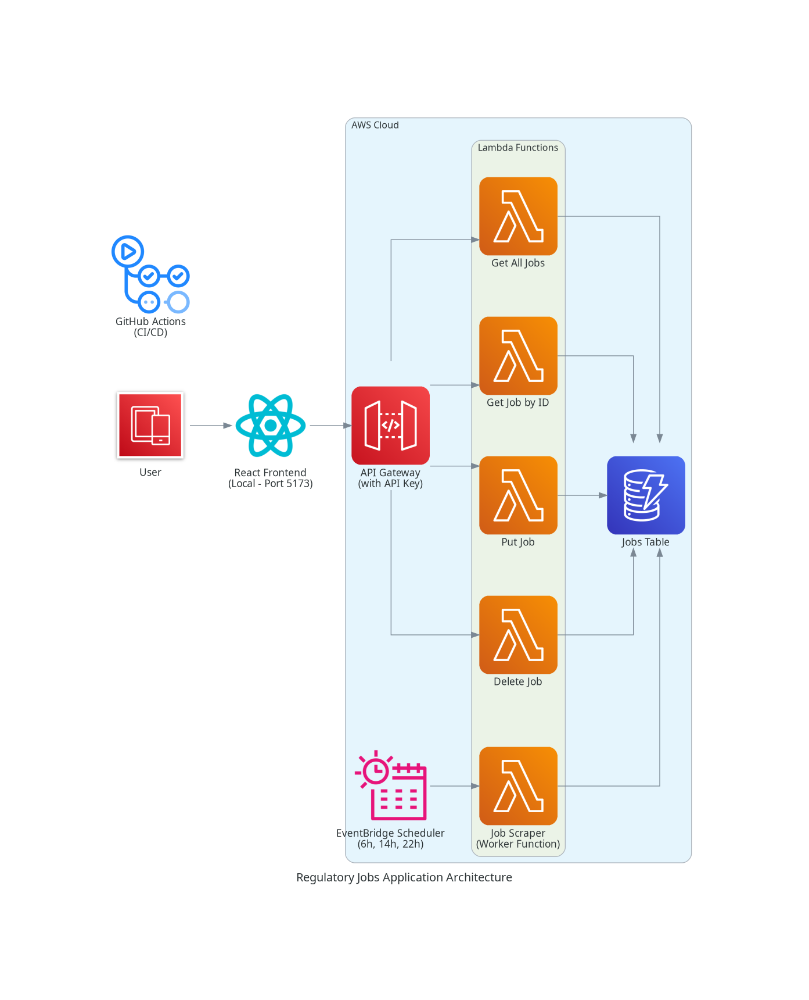

# Regulatory Jobs Application

A serverless web application that aggregates and displays medical device regulatory job postings specifically for the Île-de-France region. The application provides a REST API for job management and a React frontend for browsing opportunities.

## Project Structure

```
├── backend/           # AWS SAM serverless backend (Node.js)
├── frontend/          # React SPA (TypeScript)
├── .kiro/             # Kiro configuration and steering docs
└── README.md          # This file
```

## Architecture



*Note: If the image doesn't display, you can view the diagram source file at [assets/regulatory-jobs-architecture](assets/regulatory-jobs-architecture)*

- **Backend**: AWS Lambda functions with API Gateway and DynamoDB
- **Frontend**: React 19 with TypeScript and Vite
- **Infrastructure**: AWS SAM (Serverless Application Model)
- **Deployment**: GitHub Actions for backend, local development for frontend
- **Database**: DynamoDB with simple table structure
- **Scheduling**: EventBridge triggers worker function 3x daily (6h, 14h, 22h)

## Quick Start

### Backend Setup
```bash
cd backend
npm install
sam validate
sam build
sam local start-api  # Starts API on port 3000
```

### Frontend Setup
```bash
cd frontend
npm install
npm run dev  # Starts dev server on port 5173
```

## Documentation

- **Backend**: [backend/README.md](backend/README.md) - SAM deployment, API endpoints, local testing
- **Frontend**: [frontend/README.md](frontend/README.md) - Environment setup, development workflow

## Development Workflow

1. **Backend Development**: Use SAM CLI for local API testing and AWS deployment
2. **Frontend Development**: Use Vite dev server for fast development with HMR
3. **Integration**: Frontend connects to deployed backend API using API keys
4. **Deployment**: Backend deploys to AWS via GitHub Actions, frontend deployment TBD

## Monitoring

- **CloudWatch Logs**: Lambda function execution logs and error tracking
- **CloudWatch Metrics**: API Gateway request metrics and DynamoDB performance
- **Automated Alerts**: Monitor job scraping failures and API response times

## Key Features

- **REST API**: CRUD operations for job management with API key authentication
- **Real-time Frontend**: React SPA with job browsing and filtering
- **Serverless**: AWS Lambda functions with DynamoDB storage
- **Local Development**: Full local testing with SAM CLI and DynamoDB Local